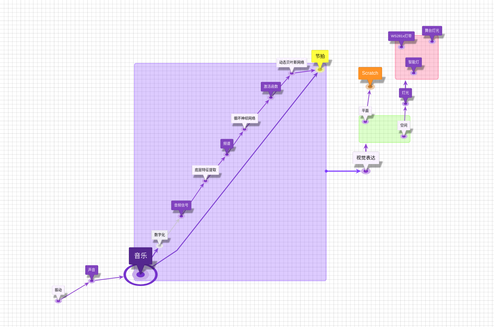
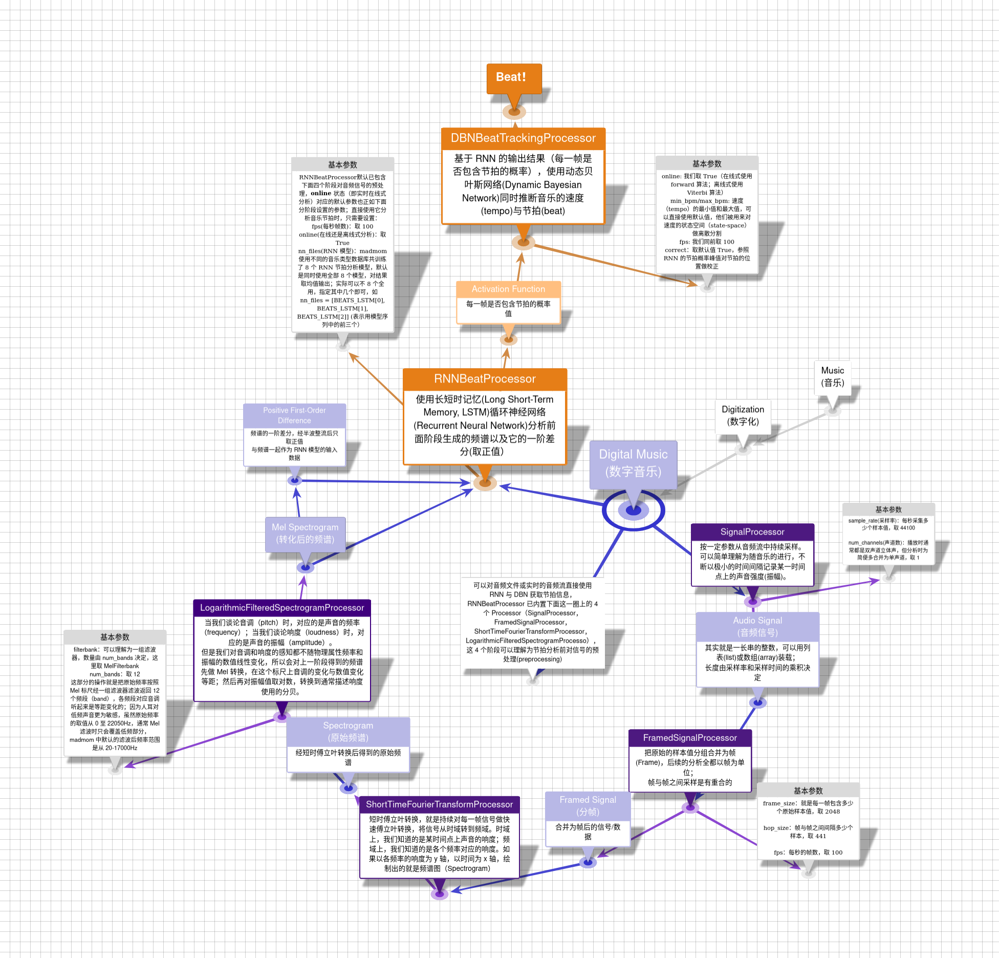
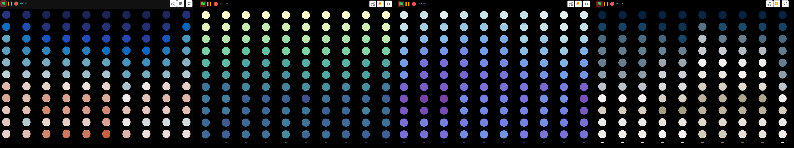
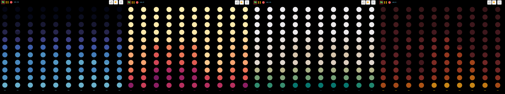
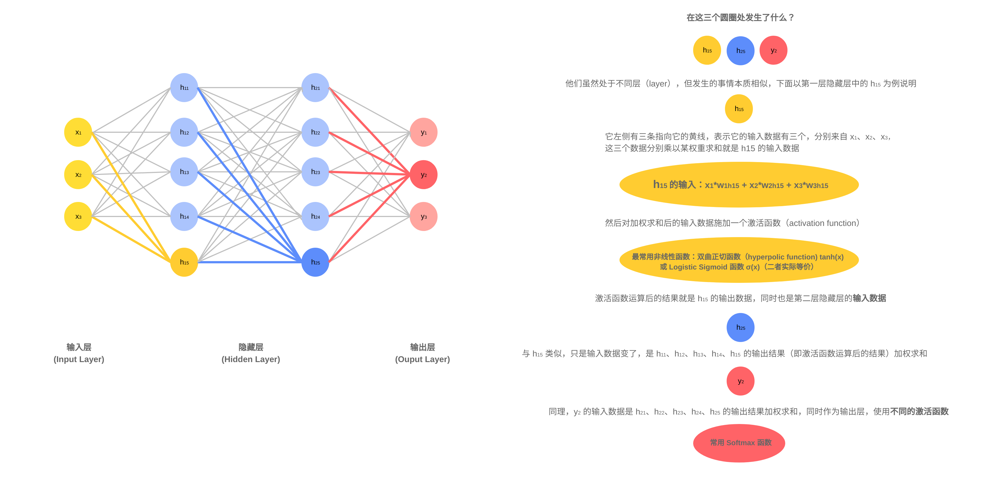
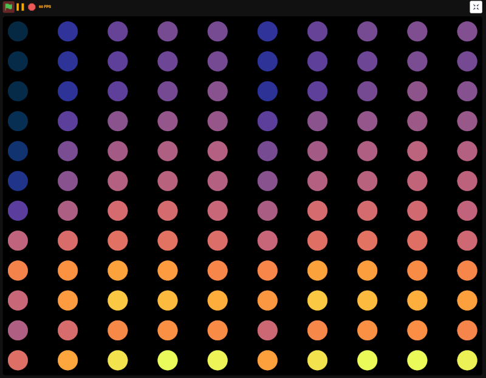

# **NeverlandBeats**

### **以编程为抓手触摸音乐的脉动；声波不止，代码不休。**







## **We are already in the *Digital World*. Do you want to *go deeper*?**


&emsp;

#### **目录**

**[1. 音乐节拍实时分析（Track the Beat on the Fly）](1.tracktheBeat.ipynb)** 

**[2. 音乐频谱实时分析（Realtime Spectrogram）](2.realtimeSpectrogram_thermal.ipynb)**

从左至右分别是：balance, deep, dense, diff； 



从左至右分别是：ice, matter, rain, solar




**[附录0：关于音频信号](appendix0_audioSignal.ipynb)**


<!--




人、故事与情感

---

当我们拥有自己的空间场地，有投影、音响、灯光，甚至还有雷达等传感设备，我们距离一场演出（音乐或戏剧）还有多远？还差什么？

当房间内的这些设备都是可以灵活编程控制的，当我们有强大的 Python、Scratch 以及连接、补充他们的 Adapter 等软件工具，如果去做，演出会不会更 Live？

我只是把问题抛出来，凭一己之力无法回答，但常言道，***The Show Must Go On***。

下面把在这个方向上做的一点工作整理汇总如下，各部分项目大致按复杂程度降序排列；链接指向的是本仓库内对应笔记本，如有 Demo 视频，则笔记本中先视频示例、再给出 Demo 代码、最后是单独的某具体功能代码。


## **Neonlights | 交互使用 树莓派、Python、Adapter、Scratch 与 NeoPixel（ws2812）**

效果满意，过程勉强，具体见 neon_pixel notebook 及 [CodeLab 视频页](https://codelab.club/)。

## **使用 Python，Adapter EIM 插件和 Scratch 实时绘制音乐频谱**

这部分目前有以下两个项目，原理都是用 python 对音频数据做实时分析，同时经 Adapter EIM 插件将分析结果发给 Scratch，再使用画笔功能动态绘制图形。可以直接利用 Python 代码在浏览器新窗口中自动打开对应的 Scratch 项目并运行，也可以手动打开 Scratch 项目后再运行 Python 代码。（Python 还有 Scratch 对应代码库内都有备份，但如果要自动打开并运行 Scratch 对应项目，需使用线上社区版，地址见下面链接）

音频流的配置与数据提取依赖 pyaudio 实现，音频数据分析就是将信号从时域经傅立叶转换到频域。P1 与 P2 的区别在于，P2 只是对每次从音频流中提取的数据做 FFT（Fast Fourier transform）分析，然后将 0-22050Hz 的频率按对数关系分为 10 个频段呈现对应的振幅强度，在 Scratch 中类似 bar 图效果；P1 相比 P2 多了时间的维度，做的是 STFT（Short-time Fourier transform） 分析，依赖 madmom 包获取 spectrogram 结果，对应 Scratch 中 12 * 10 的圆点矩阵，每 1 列是一个时间点，12 行数据分别对应 12 个频段的振幅强度。

运行 python 代码前，需要先选择音源的输入设备，是来自电脑内置的麦克风、还是耳机等，当前代码不包含选择输入设备这一项功能（但依赖 pyaudio 其实可以做到），pyaudio 会使用默认的输入设备，而输入设备间的切换是通过 pavucontrol（ubuntu 系统）手动实现的。如果发现没有数据很可能就是音源输入设备的选择问题。因为 madmom 也是依赖 pyaudio，所以 P1、P2 都是如此。

使用 Scratch Addon，选择 **fps=60**、**高清画笔**模式，自定义舞台大小，视觉效果明显更好。

### **P1：Python 代码[在此](AA_madmomspectrogram.ipynb)，（自启动）Scratch 代码[在此](https://create.codelab.club/projects/9942/)，（手动启动）Scratch 代码[在此](https://create.codelab.club/projects/10022/)**


**待优化：**

已解决，卡顿是因为中间发送数据时混杂了所有值为 0 的列表，原因在于没有 cleanup，使用 try 与 except 结构及时终止关闭 pyaudio stream 即可
+ Scratch 实时画图过程中，每隔一段时间会有明显的卡顿，还不清楚原因

已实现
+ Scratch 中圆点的颜色用来反映该频段振幅强度的大小，目前颜色与数值的映射关系比较简单，视觉效果一般，下面可尝试参照 matplotlib 在 Scratch 中实现 colormap

暂不考虑
+ 相比 P2 多了时间的维度，但只是 1 帧呈现 10 个时间点，然后靠屏幕刷新反映时间的变化，考虑是否将视觉效果做成图形自右向左流动呈现


### **P1 色彩升级**

当数据依赖色彩说话，色彩的选择就很重要。如下图所示，作为第一个 demo，将 colormap 之 [thermal](https://matplotlib.org/cmocean/#thermal) 引入 Scratch，更合理美观地呈现音乐频谱。

python 代码[在此](online_spectrogram_thermal.ipynb)，Scratch 代码[在此](online_spectrogram_thermal.sb3)。




### **P2：Python 代码[在此](AA_realtime_audiofft.ipynb)，（自启动）Scratch 代码[在此](https://create.codelab.club/projects/9943/)，（手动启动）Scratch 代码[在此](https://create.codelab.club/projects/10021/)** 


## **依赖 ❤️**


+ **[pyaudio](https://people.csail.mit.edu/hubert/pyaudio/docs/)**

    Ubuntu 可能需要先安装依赖： ```sudo apt install libportaudio0 libportaudio2 libportaudiocpp0 portaudio19-dev```

+ **[madmom](https://github.com/CPJKU/madmom)**

    最好参照[官方文档](https://madmom.readthedocs.io/en/latest/installation.html#install-from-source)复制仓库源码安装开发版，因为后面实时分析节拍时可能要使用稳定版中没有的脚本  

    不支持 ```pip install -e git+https://github.com/CPJKU/madmom#egg=madmom``` 这种安装方式

+ **[CodeLab Adapter](https://adapter.codelab.club/get_start/gs_install/)**

+ **[numpy](https://numpy.org/)**


## **参考 ❤️**


**关于傅立叶转换**

+ [But what is the Fourier Transform? A visual introduction](https://www.youtube.com/watch?v=spUNpyF58BY)

+ [An Interactive Guide To The Fourier Transform](https://betterexplained.com/articles/an-interactive-guide-to-the-fourier-transform/)

+ [(Visual) Understanding the Fourier transform](https://web.archive.org/web/20120418231513/http://www.altdevblogaday.com/2011/05/17/understanding-the-fourier-transform/)

**关于音频流**

+ [Audio I/O: Buffering, Latency, and Throughput](https://in.mathworks.com/help/audio/gs/audio-io-buffering-latency-and-throughput.html)

    matlab audiotoolbox 系列文档有很清晰的解释

**关于音频的实时分析与频谱绘制**

+ [Frequency spectrum using FMOD and UE4](https://www.parallelcube.com/2018/03/10/frequency-spectrum-using-fmod-and-ue4/)

    如何 track the beat，作者写了一系列的文章，虽然用的不同软件，但是作者分享的思路非常重要。P2 中对频段的划分就是依据这篇文章。

+ [Recording Stereo Audio on a Raspberry Pi](https://makersportal.com/blog/recording-stereo-audio-on-a-raspberry-pi)

    这个网站的作者分享了多个音频相关的项目，是读过教程中对数据提取与分析流程最完整严谨的。

+ [Audio Handling Basics: Process Audio Files In Command-Line or Python](https://hackernoon.com/audio-handling-basics-how-to-process-audio-files-using-python-cli-jo283u3y)

+ [Realtime FFT Audio Visualization with Python](https://swharden.com/blog/2013-05-09-realtime-fft-audio-visualization-with-python/)

+ [Realtime FFT Audio Visualization with Python](https://blog.yjl.im/2012/11/frequency-spectrum-of-sound-using.html)

**关于 Colormap**

[Why Should Engineers and Scientists Be Worried About Color?](http://mkweb.bcgsc.ca/brewer/talks/engineers.scientists.color.worry.pdf)

[Beautiful colormaps for oceanography: cmocean](https://matplotlib.org/cmocean/#thermal)

[colormap](https://github.com/BIDS/colormap)

-->
